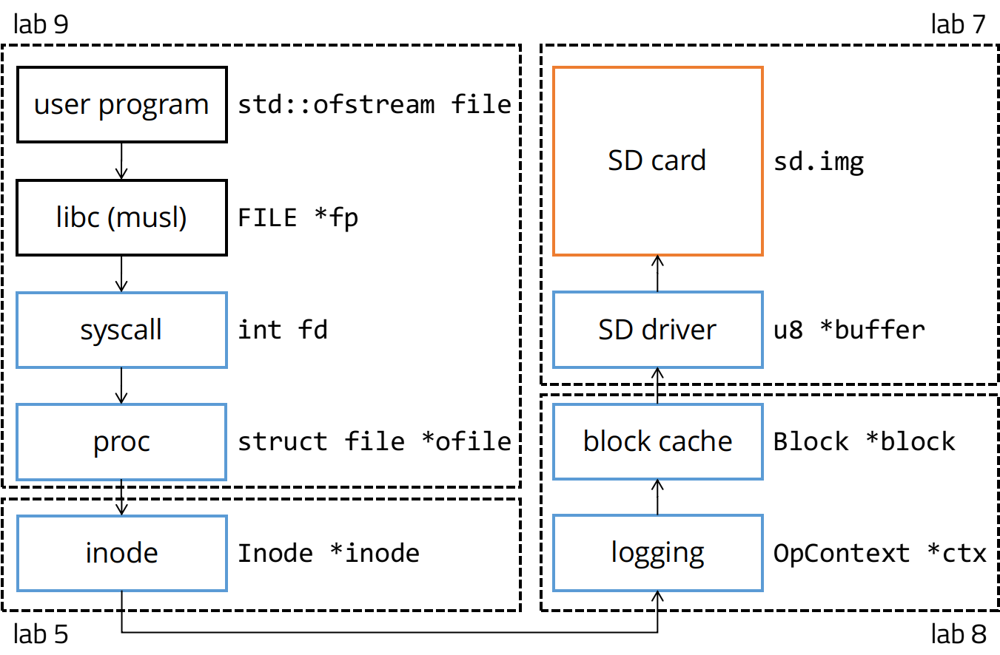
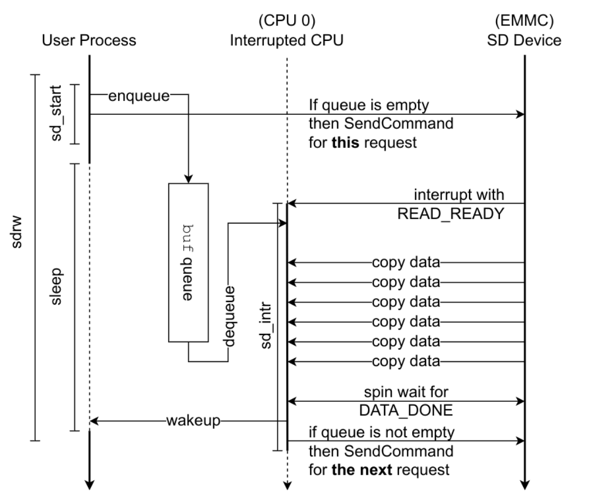
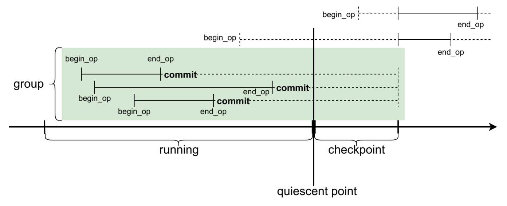
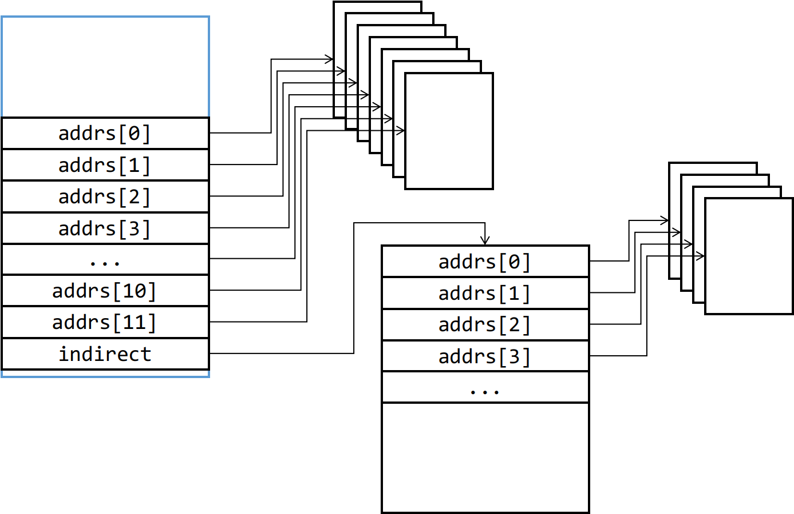
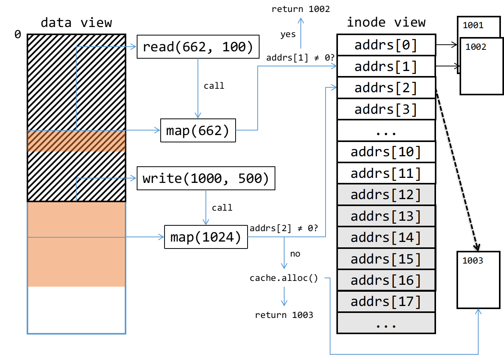

# RPI-OS 文件系统部分

### 参考资料

 - xv6 book: <https://pdos.csail.mit.edu/6.828/2021/xv6/book-riscv-rev2.pdf>
    - 主要是第 8 章

### 整体架构

整个文件系统分为四个部分。从底层至顶层分别是：

- SD 驱动
    - 借助网上开源的 EMMC 驱动，从 SD 卡中读取硬盘原始数据。读取的单位是大小为 512 字节的块（block）
- 块缓存
    - 缓存先前读取过的块，延迟块数据的写入，以减少与 SD 卡的直接交互，提高系统整体性能
    - SD 卡只支持 512 字节的单个块的原子读写。块缓存使用日志机制，提供更大的原子操作支持。每个原子操作可以写入若干的块，它们要么全部成功写入，要么没有块被写入
- Inode 缓存
    - Inode 是管理数据的元数据（metadata）。这一层实现 inode 对象，并提供和块缓存类似的缓存机制，减少实际硬盘读写
- 文件层
    - 实现文件相关的系统调用
    - C library 使用 musl

### SD 驱动

我们的 SD 驱动主要分为三个部分：

- 开源的 EMMC 接口驱动
    - 免去我们自己编写和 EMMC 接口交互的代码。此时我们可以单线程同步读写 SD 卡了
- SD 中断处理函数 `sd_intr`
    - OS 肯定不能总是忙等待 EMMC 接口完成读写。使用中断机制可以实现异步读写。OS 发送完读写请求后就可以立即切换到其它任务上。当 SD 卡完成时，由 `sd_intr` 函数接收通知
- 多生产者单消费者队列，`buf` 队列
    - OS 中会有多个进程同时运行，但是 EMMC 接口和 `sd_intr` 只有一个，必须复用。因此我们需要实现一个缓冲队列，让 SD 驱动可以同时服务多个线程

SD 驱动需要实现以下函数：

- `buf` 队列相关函数：注意用锁控制并发
- `sleep`/`wakeup`：进程休眠、唤醒。正在执行 IO 请求的进程需要通过 `sleep` 把 CPU 让出来。相应的，IO 操作完成时，OS 使用 `wakeup` 把对应进程唤醒
- `sd_intr`：SD 中断处理函数，从 `buf` 队列弹出一个请求并通知对应进程
- `sd_start`：发出一个新的 SD 读写请求，即将请求压入 `buf` 队列

为了验证 SD 驱动的正确性，可以尝试读取 SD 卡上的第一个块：MBR 块。从中你可以了解这个 SD 卡上有哪些分区，对应的偏移量是多少。之后我们会在其中一个分区上构建文件系统。

### 块缓存

块缓存这一部分有两个任务：

- LRU 缓存：这一部分原理比较简单
- 实现原子操作

原子操作使用日志机制实现。基本思想是：所有写操作首先缓存在内存中；提交后，先写到 SD 卡的日志区域，等写入完成后在写到正确的位置。这样，如果原子操作的提交过程出现故障，只能是两种情况之一：

- 在写日志完成之前出现故障：可以认为这次原子操作失败。此时写操作对应的块实际上还没有被覆盖，就是原子操作之前的数据
- 在写日志完成之后出现故障：重启时会发现日志区域有数据，此时可以重新把日志区域的数据写入到正确的位置上，即重放（replay）

接下来我们可以讨论一下原子操作的声明周期：

- `begin_op`：开启一个新的原子操作
- `sync`：显式地将块写入和一个原子操作关联
- `end_op`：提交原子操作。`end_op` 需要等到所有关联的写操作成功落盘后才能返回
    - `end_op` 可以分为两步：`commit` + `checkpoint`

从块的视角来看是这样的：

- 上层拿到了块的指针，并写入了新的数据
- 上层通过 `sync` 告知块缓存之后要把这个块写回 SD 卡。`sync` 之后应该确保这个块的内容不会被修改。这里既可以立即复制块的内容到另一个内存区域中，也可以是在块缓存中打一个标记，之后如果有其它写入，再按需复制，即 copy-on-write
- `end_op` 时，块数据首先写入日志区，然后再写到正确的位置

接下来介绍一个优化技巧：批量处理（batch），或者叫 group commit/checkpoint。其思想是将若干个原子操作攒在一起，并且隐式地由块缓存合并为一个原子操作。这样可以增大单个原子操作中的块数量。如果多个原子操作在读写相同的块，那么这些写入就可以被合并成一次写入。不过这么做的风险是，出错时丢失的数据可能会比之前多。因此，现实生活中的 OS 通常是将若干分钟内的写入批量处理，超过时间阈值了也会直接写入，避免丢失过多的数据。Group checkpoint 的流程如下：

这里面的限制因素主要是 SD 卡上日志区域的大小。单个原子操作的大小不能超过日志区域的大小。为了确保不会溢出，OS 限定了每个原子操作最多关联的块写入的数量，并且在 `begin_op` 时就在日志区域中预留对应的数量。如果有很多并发的原子操作，OS 会阻塞部分 `begin_op`，直到能够预留处足够的日志区域时才返回。在提交原子操作时，需要等到同一组所有原子操作都完成了，才能进行落盘。这个时间点也就是上图中 “quiescent point” 所指的位置。

### Inode 缓存

经过前两步，我们已经有了一个高效的块读写接口了。接下来，我们会在这个块读写接口的基础上，实现基本的文件抽象：inode。简而言之，inode 和一般意义上的文件是一一对应的。每个文件都有一个 inode，无论它是普通文件还是设备文件。对于普通文件，inode 还有一个可以动态增长的二进制数据区（blob）。Inode 在文件系统中以目录树的形式组织起来。值得一提的是，目录本身就是一个特殊的文件。

我们主要关注普通文件对应的 inode 该如何实现。首先，inode 上需要存储一些元信息，例如文件类型、文件大小、inode 编号等。此外，inode 需要维护一个块编号数据，记录哪些 SD 块上面有这个 inode 的二进制数据。在 RPI-OS 的文件系统中，我们在 inode 结构体内部直接存储 12 个块编号，方便小文件的读写。对于大文件，我们另外在 inode 内存储一个间接块的编号（indirect block）。间接块内可以存储很多数据块的编号。总体结构如下所示：

在实现过程中，建议先实现 `inode_map` 函数。之后 `inode_read` 和 `inode_write` 都可以调用 `inode_map` 来找到文件偏移量对应的数据块的编号。以下是 inode 读写的一个示例：

Inode 缓存这一部分大部分函数的实现都是比较直观的。这里只强调一下 inode 中 `inode_lock`/`inode_unlock` 和 `inode_get`/`inode_put` 分离的设计。前者是加锁、放锁，用于申明临界区域，避免并发读写同一个 inode。后者是修改引用计数，只要 inode 的引用计数不会 0，inode 就会存在于内存中。RPI-OS 的文件系统中，每个文件结构体（`struct file`）会持有一个 inode 的指针。只要文件没有关闭，指针指向的 inode 就必须能够读写。同一个文件可以被多个进程打开，因此可以有多个文件结构体持有同一个 inode 的指针，但它们并不是一直会使用这个 inode，因此我们需要分离加锁和引用计数。而在块缓存中，一个 SD 数据块被一个 inode 独占，不会被多个 inode 共享，因此引用计数至多为 1，也不需要加锁和引用计数分离的设计。

### 文件层

这一层属于接入 musl 的一部分，需要在进程结构体内添加已打开的文件数据，并实现一系列和文件相关的系统调用。RPI-OS 需要适配 musl，因此系统调用应符合 POSIX 语义。于是我们可以参照这些系统的 manual 来实现。
